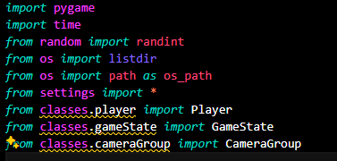
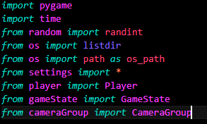

# PokèScrauso
[ENG](./README_ENG.md)

PokèScrauso è un un progetto realizzato da 5 studenti di 4° superiore durate l'esperienza di pcto presso l'azienda AddValue.
Questo consiste in un gioco fortemente ispirato ai giochi Pokemon realizati da GameFreak, ma con aggiunte delle personalizzazioni.


## Installazione

Usa il gestore di pacchetti [pip](https://pip.pypa.io/en/stable/) per installare i pacchetti necessari attraverso il seguente comando eseguibile tramite cmd.

```bash
pip install numba pygame 
```

## Metodi di utilizzo

Attualmente è possibile giocare solamente tramite l'avvio del programma main.py, è però in programma la realizzazione di un file eseguibile (.exe) per permettere un avvio più semplice.
Per modificare le impostazioni è possibile aprire il file settings.txt, ma stiamo lavorando alla realizzazione di un'interfaccia grafica che permette di modificare le impostazioni direttamente dal gioco.

## !ATTENZIONE!

In caso l'avvio del file main dia l'errore  
```bash
ImportError: cannot import name 'Game' from 'game'
```
per risolverlo è possibile spostare i file main.py e settings.py nella cartella classes e modificare il file game.py in questo modo:




## Crediti
Noi non possediamo alcun elemento di questo gioco, tutti gli asset utilizzati per la realizzazione di questo gioco appartengono ai rispettivi possessori.

## In quanto questo progetto è stato realizzato puramente per sfidare noi stessi e senza lo scopo di lucro, dichiariamo che la distribuzione di PokeScrauso è assolutamente vietata.